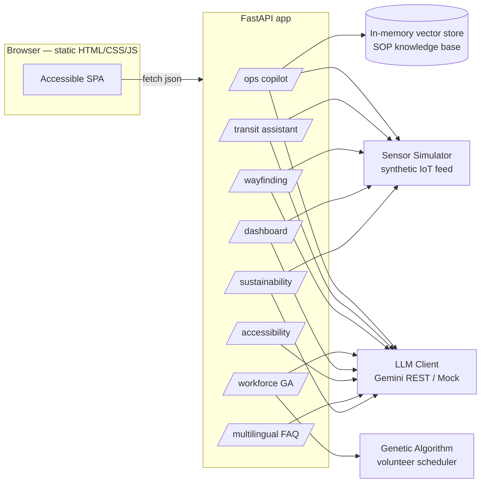

# StadiumPulse AI

**A GenAI operations copilot for Smart Stadiums & Tournament Operations — built for the 2026 FIFA World Cup.**

StadiumPulse AI is a production-grade, GenAI-powered platform that unifies stadium operations across the tri-nation 2026 FIFA World Cup (United States, Mexico, Canada). It addresses the operational complexity of a 48-team, 104-match tournament spanning 16 host cities and 16 stadiums, where each venue must simultaneously manage crowd safety, multilingual fan services, transportation logistics, energy sustainability, workforce coordination, and real-time accessibility — all at unprecedented scale.

The platform provides seven integrated modules, each leveraging Generative AI (Google Gemini) for grounded, hallucination-resistant natural language output across all supported languages.


## Problem alignment

The challenge brief names eight capabilities. Each maps to a concrete, working module:

| Challenge requirement | Module | Mechanism |
|---|---|---|
| Navigation | Wayfinding | Seat/section → nearest gate, restroom, concession, or accessible entrance, with live congestion rerouting |
| Crowd management | Sensor Simulator + Dashboard | Per-gate density random-walk with injected anomalies, alert thresholds, live dashboard |
| Accessibility | Accessibility Hub | Generative audio-description commentary + WCAG-conscious UI (semantic landmarks, ARIA tabs, keyboard nav, high-contrast mode, adjustable text size, browser TTS) |
| Transportation | Transit Assistant | Deterministic routing over all 16 FIFA 2026 host cities with real transit modes, congestion-aware gate rerouting |
| Sustainability | Sustainability Engine | Per-zone HVAC/lighting load estimate from live density + temperature, flags reducible zones, computes kW savings |
| Multilingual assistance | Fan FAQ + every module | 12-topic multilingual FAQ + every generative call across the app accepts a target language (English, Spanish, French, Portuguese, Arabic, Hindi, Mandarin) |
| Operational intelligence | Ops Copilot | RAG: 8 SOP knowledge-base documents + live IoT sensor feed → grounded incident diagnosis |
| Real-time decision support | Ops Copilot + Dashboard | Live sensor-grounded recommendations refreshed on every request |

A **Workforce Scheduler** (genetic algorithm over volunteer skills, languages, and shift fairness, with LLM-drafted briefings) covers staff coordination — core to "the overall tournament experience for ... volunteers."


## Architecture



## Tech stack

- **Backend:** FastAPI (async), Pydantic v2 with strict typing and StrEnum validation, pure-Python genetic algorithm, NumPy for cosine similarity.
- **LLM:** Google Gemini via direct REST calls (`httpx`), with a deterministic mock provider for tests and offline fallback.
- **Frontend:** No build step — semantic HTML5, vanilla JS, CSS with a high-contrast theme, full ARIA tab navigation, and browser TTS for accessibility commentary.
- **Quality:** `ruff` (lint, 11 rule categories), `mypy` (strict, disallow_untyped_defs), `pytest` (40+ tests). All run in CI on every push.
- **Deployment:** Single Docker container (non-root), designed for Google Cloud Run.

## Project structure

```
stadiumpulse-ai/
├── app/
│   ├── main.py
│   ├── config.py
│   ├── security.py
│   ├── schemas.py            # request/response models + StrEnum types
│   ├── dependencies.py
│   ├── logging_config.py
│   ├── sustainability.py
│   ├── py.typed              # PEP 561 type-checking marker
│   ├── llm/                  # provider-agnostic LLM client (Gemini / mock)
│   ├── rag/                  # vector store + 8 SOP knowledge-base documents
│   ├── sensors/              # synthetic IoT crowd density feed
│   ├── transit/              # 16 FIFA 2026 host cities + grounded routing
│   ├── navigation/           # in-venue seat-to-amenity wayfinding
│   ├── multilingual/         # 12-topic grounded fan FAQ
│   ├── workforce/            # genetic algorithm + demo dataset + messaging
│   ├── accessibility/        # generative audio-description commentary
│   ├── ops/                  # incident-diagnosis copilot (RAG + sensors)
│   └── routers/              # HTTP route wiring per module
├── static/                   # index.html, styles.css, app.js
├── tests/                    # 40+ tests with shared conftest fixtures
├── .github/workflows/ci.yml
├── Dockerfile
├── docker-compose.yml
├── pyproject.toml
├── requirements.txt
├── requirements-dev.txt
├── SECURITY.md
└── .env.example
```

## Run locally

Requires Python 3.12+.

```bash
python -m venv .venv
# macOS/Linux
source .venv/bin/activate
# Windows
.venv\Scripts\activate

pip install -r requirements-dev.txt
# macOS/Linux
cp .env.example .env   
# Windows: 
copy .env.example .env

uvicorn app.main:app --reload --port 8080
```

Open `http://localhost:8080`. Without a `GEMINI_API_KEY` the app runs in **mock mode** — every feature works, but generated text is a fact summary instead of natural language. Add your key to `.env` to enable Gemini:

```
LLM_PROVIDER=gemini
GEMINI_API_KEY=your-key-here
```

## Environment variables

| Variable | Default | Purpose |
|---|---|---|
| `LLM_PROVIDER` | `gemini` | `gemini` or `mock`. Auto-falls back to `mock` if no API key is set. |
| `GEMINI_API_KEY` | *(empty)* | Google AI Studio API key. |
| `GEMINI_MODEL` | `gemini-2.5-flash` | Text generation model. |
| `GEMINI_EMBED_MODEL` | `gemini-embedding-001` | Embedding model for RAG retrieval. |
| `OPS_API_KEY` | `DEMO-OPS-KEY-2026` | Shared secret for staff-only endpoints. **Change before deployment.** |
| `ALLOWED_ORIGINS` | `*` | Comma-separated CORS allow-list. |

## Staff-only features

The **Ops Copilot** and **Workforce Scheduler** tabs require the Staff API Key. Enter `DEMO-OPS-KEY-2026` (the default `OPS_API_KEY`) into the Staff API Key field.

## Quality checks

```bash
ruff check app tests
mypy app
pytest -q
```

Tests cover: GA determinism and constraint satisfaction, RAG retrieval relevance, transit routing across all 16 host cities, wayfinding with congestion rerouting, the sustainability energy model, all 12 multilingual FAQ topics, and full HTTP contract tests (including 401/429 security paths).

## API reference

| Method & path | Auth | Purpose |
|---|---|---|
| `GET /api/health` | — | Liveness + active LLM provider |
| `GET /api/dashboard/summary` | — | Aggregated live view for the ops dashboard |
| `GET /api/ops/sensors` | — | Current synthetic IoT snapshot |
| `POST /api/ops/query` | `X-API-Key` | RAG-grounded incident diagnosis |
| `GET /api/transit/cities` | — | All 16 FIFA 2026 host cities |
| `POST /api/transit/route` | — | Grounded, congestion-aware route + narrative |
| `POST /api/navigation/wayfind` | — | Seat/section → nearest amenity, congestion-aware |
| `GET /api/accessibility/events` | — | Demo match-event feed |
| `POST /api/accessibility/commentary` | — | Generative audio-description text |
| `GET /api/multilingual/topics` | — | Fan FAQ topic list (12 topics) |
| `POST /api/multilingual/faq` | — | Grounded FAQ answer in the requested language |
| `GET /api/sustainability/report` | — | Per-zone energy estimate + reduction opportunities |
| `POST /api/workforce/optimize` | `X-API-Key` | Runs the GA, returns fitness/coverage metrics |
| `GET /api/workforce/briefing/{id}` | `X-API-Key` | LLM-drafted personalized shift briefing |

## Security

See [SECURITY.md](SECURITY.md) for the full security policy.

- Staff-only endpoints require a shared `X-API-Key` header.
- Per-IP sliding-window rate limiter (30 req/min) on every endpoint.
- All request bodies length-constrained via Pydantic with StrEnum validation.
- The LLM only phrases facts computed in Python — never invents information.
- Docker container runs as non-root user.

## Deploy to Google Cloud Run

```bash
gcloud run deploy stadiumpulse-ai \
  --source . \
  --region us-central1 \
  --allow-unauthenticated \
  --set-env-vars LLM_PROVIDER=gemini,GEMINI_API_KEY=YOUR_KEY,OPS_API_KEY=YOUR_STAFF_KEY
```

## License

MIT — see `LICENSE`.
